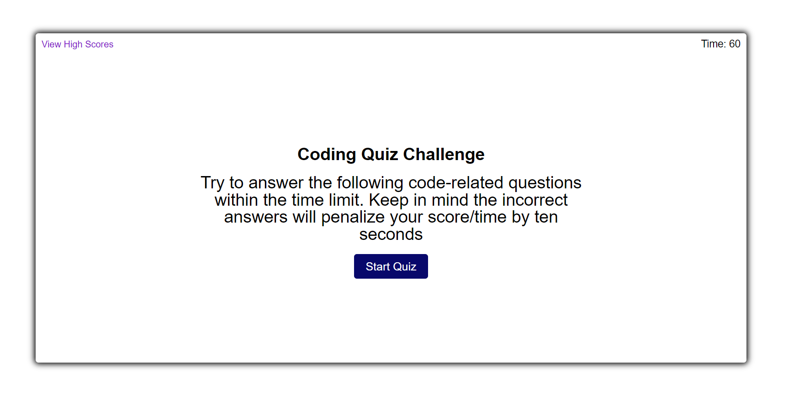

# Coding-Quiz

## Description:
Coding Quiz Application To Determine the Coding Knowledge of the User. This application is a timed multiple choice quiz that will demonstrate the users knowledge and help prepare them for the technical interview process. The user is first prompted with the rules of the Coding Quiz Challenge which is to answer the code-related questions within the time limit of 60 seconds and there is a countdown in the top right corner of the application. For each incorrect answer the user will be penalized by 10 seconds. After reading the rules the user can begin the quiz by clicking on the Start Quiz button. As the user goes through the quiz and selects their answer they will be notified below the answer choice buttons if the choice was either Correct or Wrong. When the user has reached the end they will be given a score of how well they did from 0 to 100 and then they will enter their initials which will save the users initials and score. The application contains a View High Scores button in the top left corner that when clicked will present the list of top scores from users with the initials and score. After initials are input with the score the user can choose to either restart or clear the High Scores if they wish. 

## Assets:

The following image demonstrates the web application's appearance and functionality:

## The URL of the deployed application:

https://jerrickjohnson.github.io/Coding-Quiz/

## The URL of the GitHub repository:

https://github.com/JerrickJohnson/Coding-Quiz.git
